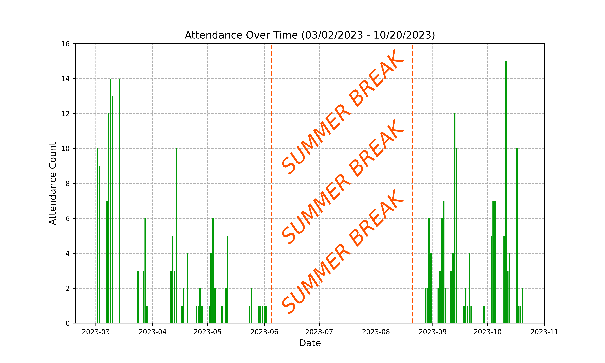
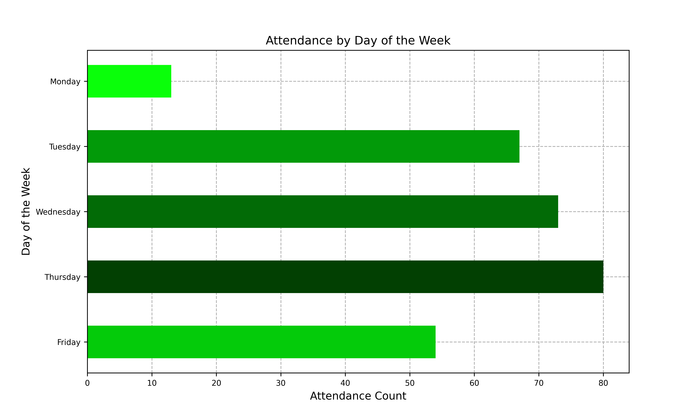
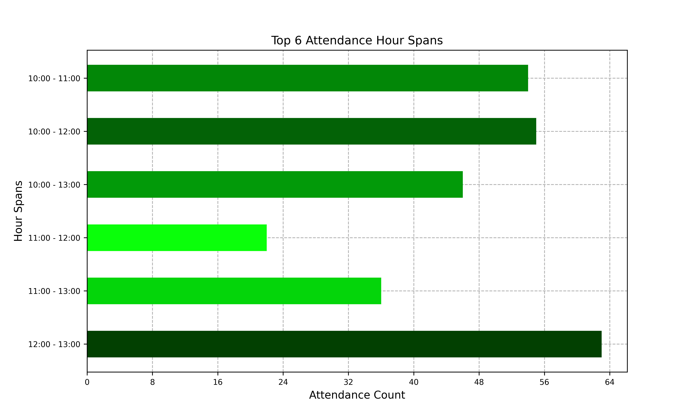
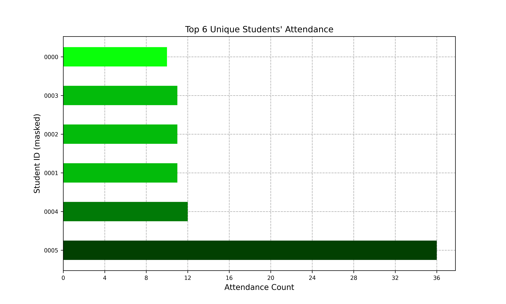

# ServicioSocial_ITT
Source code for analyzing the attendance list from my Community Service in the Programa de Asesorías Académicas (Academic Tutorship Program) at UABC Otay Campus. The public records document activity from March 2 through October 20, 2023.

# Author

- Abraham Jhared Flores Azcona _(NotsoJharedtrollOx17)_  ``abrahamjhared.flores@gmail.com``

# Abstract

Brief report regarding my duties as an academic tutor of the Programa de Asesorías Académicas (Academic Tutorship Program) of UABC Otay Campus. We describe the main activities of the role, as well as the collected results coming from my observations, professional judgements, and data plots about the affluent student attendance rate during the position. We noticed that around 50 students attended the tutorships to receive support with the subject of _Differential Calculus_. With the previous result, it is imperative to tutor that particular subject to satisfy its demand and to strengthen the skills of the students. Consequently, the recommendations for the program are to (1) accommodate the demand with work groups, (2) manage relevant vocabulary to the class, and (3) train the tutors to know how to deal with students with severe cognitive blocks.

# Introduction

On the frame of my commitment towards academic development and its community, I had the privilege to enact the role of an Academic Tutor in the Universidad Autónoma de Baja California (UABC). Throughout this report, I share my experience during my duties focusing on the activities performed, the results obtained, and the recommendations proposed. This report, written in collaboration with the Instituto Tecnológico de Tijuana (ITT), comprises a crucial material for the accreditation of the Community Service requirement.

# Activity Development

Given that the requested position was of an academic tutor, the main objective of my activities focused on _tutoring the engineering students on their academic duties_. The supplementary activities done were: (1) to offer academic tutoring in the areas of mathematics and chemistry, (2) to perform study workshops in mathematics and chemistry, (3) coordinate study groups in mathematics and chemistry, (4) attend the tutorship program in accordance to the schedule, (5) to submit the quarterly activity report, and (6) to submit the final activity report.

Going into detail with each of the supplementary activities: (1) consists on explaining the solicited topics with greater detail in accordance to the solicitor's level, with a prior appointment, (2) is the group extension of (1), (3) is to take leadership during the sessions and to solve the solicited problem sets by the students, (4) is about being professional and to attend the call of duty in the established schedules by the program's supervisor, and the previously scheduled appointments with the students, and finally, (5) and (6) consist on the follow-up of the registered community service hours with the reports that the Instituto Tecnológico de Tijuana requires to effectively fulfill community service, including the writing of this report.

# Results

The public records document academic tutoring activity from March through October 2023 in _Differential Calculus_, _Programming Methodology_, and _Programming and Numerical Methods_. In total, 62 unique students registered attendance. The public CSV contains 287 attendance rows, including three pairs of identical rows that must be reconciled with the original sign-in sheets before reporting a definitive visit total. Figure 1 shows attendance throughout the documented period; the original report associated several peaks with examination periods.

The vast amount of registered attendances where overall found in the subject matter of _Differential Calculus_, where most of the students had lectures with the same professor. This detail assisted greatly with the supervision of their progress and any shortcomings with the class.

In my particular case, the attendance record sheets were completely filled every 3 days per week. Usually, Wednesdays and Thursdays registered greater student affluence, which can be appreciated in Figure 2. This fact allowed me to record a recurrent student's weekly rate of 60% per week. This represents the percentage of students that registered an attendance rate of 2 or more days per week. Said trend decreased throughout the duties.

Similar to the previous paragraph, it was also usual to help students during the hours from 10:00 PST until 12:00 PST, and from 12:00 PST until 13:00 PST [Figure 3]. Other hour ranges intersect with the two ranges previously mentioned. The tutored students stated multiple times that they had schedule availability due to being conditioned to pass _Differential Calculus_. This forced them to only enroll three classes, including the aforementioned failed class, with the intention to provide enough time to satisfy this curriculum debt. I can infer that these peak "rush hours" were influence by that schedule availability.

Finally, a very peculiar pattern was appreciated with 6 students. 5 of them attended the tutorships around 10 times, while one of them (0005) achieved an attendance record count of 36 [Figure 4]. I can only assume that, for said student, passing the class was so crucial to attend the tutorship sessions 36 times during the position.



**Figure 1.** Attendance over time from March 2 through October 20, 2023.



**Figure 2.** Attendance by Day of the Week. _Note_: we exclude Saturdays and Sundays because we did not work during those days.



**Figure 3.** Top 6 Attendance Peak Hours. 



**Figure 4.** Top 6 Attendance Records from Unique Students.

# Conclusions

My experience as an academic tutor during my Community Service requirement for the Instituto Tecnológico de Tijuana has been enriching and gratifying. During this period, I have dealt with the professional matter, as well as the personal matter of this job with profound dedication.

On the professional matter, I reaffirmed that this position aligns perfectly with the notion of community service proper. The essential function of an academic tutor is to guide students by sharing acquired knowledge and experiences throughout one's own educational path. Having selected the option to tutor classes such as _Differential Calculus_ has demonstrated to be a pertinent and precise decision due the constant flux of students searching for help and support on said class.

With regards to interpersonal matters, having established rapport and conversation with the vast majority of my tutor colleagues promoted a culture of camaraderie. At the same time, this allowed us an established exchange of ideas and interests of academic and personal kind, which further motivated us to cooperate further in our duties.

The attitude differences between individual and group sessions are noticeable. Group sessions, according to my perception and judgement, generate a sense of collaboration and belonging. This especially happens when the students share professors or class groups. On the other hand, individual sessions can reveal the attendance trends of said individuals, as observed throughout my responsibilities, for cases of severe academic pressure or previous difficulties with the subject matter.

Overall, this period was fruitful for the student community of UABC due the affluent attendance of the students. This reinforced my passion for public servitude and knowledge sharing, which represents a new avenue towards personal and professional growth. For the foreseeable future, I'm convinced that becoming a University Professor is an excellent option for my professional career.

# Recommendations

Based on my experience within the Community Service at the Universidad Autónoma de Baja California (UABC), I identified a series of improvement areas that could benefit and optimize the tutorship experience. Although I recognize that each students' personal context and each subject matter may require specific adjustments, these suggestions are derived from my active participation on said environment. I present three recommendations which could be considered to improve the effectiveness and quality of the tutorship program:

1. _Mixed Approach for Individual and Group Sessions:_ To address the attitude difference between individual and group sessions, we can consider a mixed approach. In this case, it may be sensible to implement a combination of individual and group sessions attendingdifferent levels of the students, and at the same time, to flourish an environment of collaborative problem-solving for all involved.
2. _Promotion of Essential Vocabulary for the Tutored Subject:_ Given that the nomenclature of each subject matter is a common challenge, we can offer additional material that clarifies said essential technical vocabulary. This can benefit the students by familiarizing themselves with the necessary terms to better grasp the concepts, and allowing them to formulate more precise questions to be solved at earnest.
3. _Special Training for Tutors:_ Provide guidance and specific training to the tutors regarding  _how_ to deal with situations with students facing cognitive blocks due to difficulties on the tutored matter. It is imperative to support tutors to manage such exceptional cases in a more empathetic and effective manner for all involved.

These recommendations are destined to enrich the tutorship program and to improve the experience of the tutors and students. The combination of personalized strategies, access to additional resources, and an inherent collaborative focus, can contribute to the development and success of this academic initiative. Nevertheless, I must recognize the fact that each tutor has the discretion with regards to the tutorships sessions it teaches.

# License

MIT License

# Acknowledgement of AI Usage

We hereby state that ChatGPT<sup>1</sup> was utilized for the analysis, interpretation, and code development of the data pipeline that generated the provided plots in the report.

> <sup>1</sup> Full conversation available at [`../../ai-conversation/ServicioSocial-Data-Analysis`](../../ai-converation/ServicioSocial-Data-Analysis.md). The beginning of the backup indicates that it was extracted from Gemini because the original conversation was exported into Gemini.

# Citation

```
@misc{
    flores2024serviciosocialitt,
    title = {Reporte Final del Programa de Asesorías Academicas en la Facultad de Ciencias Químicas e Ingeniería de la Universidad Autónoma de Baja California},
    author = {Flores-Azcona, Abraham Jhared},
    year = {2024},
    month = {Feb},
    url = {https://github.com/NotsoJharedtrollOx17/ServicioSocial_ITT},
    note = {This work is an extra data analysis practice not presented with the original report for the required Community Service materials of my undergrad degree.}
}
```
